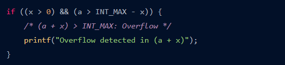

<!--
File: readme.md
Author: [Your Name]
Created on: [Date]
Description: [Brief description of the file's purpose]
-->

## Important: Please Add Your Own Report

Welcome to your report file. In the next section, please add your own report below. You can include your analysis, findings, and any relevant information.

Make sure to add your information to the begining of this file.

### Weekly Task Description

You can find the detailed description of the weekly task in the file: [task_description.md](task_description.md).

### Revision Task

For the revision task, please refer to: [revision.md](revision.md).

---

# Week 2 Report
## **Task**
* ~~**Done bài 4-12 của Học C bá đạo.**~~
* ~~**Liệt kê các cách tạo hằng số và khi nào cần sử dụng hằng số.**~~
* ~~**Liệt kê các kiểu dữ liệu kèm khoảng giá trị của nó.
Khi nào xảy ra tràn số và cách kỹ thuật tránh tràn số.**~~
* ~~**Liệt kê các định dạng có thể dùng trong printf (%d, %c,... và các định dạng mở rộng như %.2f, %02d,...).**~~
* ~~**Liệt kê các toán tử, tìm hiểu các toán tử bitwise và phân biệt sự khác nhau giữa "& với &&", "| với ||".**~~
* ~~**Học cách sử dụng git, sau đó tìm hiểu quy trình sử dụng git.**~~
* ~~**(Chỉ làm sau khi xong 1) Tạo acc github và link repo từ local với repo trên github. Phân biệt git và github.**~~
* ~~**Convert các file báo cáo thành định dạng markdown và đặt tên thành README.md**~~
---
## 1. **Done code lecture 4-12 in " Hoc C ba dao"**
## 2. **Constant**
- **Ways of declaration\:**

| **Types** | **Usage** | **Syntax** |
| --------- | --------- | ---------- |
|`const` | Mostly used for storing unchanged value for computing.|const \< data types\> \<name\> = value;   Ex\: const float pi = 3.14;|
|`enum`|Mostly used for setting up different states for a certain object.    Each variable could be assigned to a certain value and if it is not, its value will start from 0 or the subsequent one of the variable standing right before it.| enum<group name>{var_1, var_2,..};   Ex: enum months{Jan, Feb, Mar}; Ex: enum months{Jan, Feb=100, Mar};  => Jan = 0, Mar = 101.| 
|`\#define`|Used for defining a macro that replaces text before compilation|\#define \<name\> \<value\>   Ex: #define PI 3.14    \#define ll long long int  br>\#define f(i, a, b, c) for (ll i = a; i < b; i += c).|

## 3. **Variable**
| **Types** | **stdint.h** | **Size** | **Range** | **Meaning** |
| --------- | ------------ | -------- | --------- | ----------- |
|   `char`    |   int8_t     |    1   |$ -2^7  \to 2^7 -1$ |    integer, char |
`unsigned char`| uint8_t| 1| $ 0 \to 2^8$| integer, char|
`short`| int16_t|2| $ -2^{15} \to 2^{15}-1$|integer|
`unsigned short`| uint16_t|2|$ 0 \to 2^{16}$|integer|
`int`|int32_t|4|$-2^{31}\to 2^{31}-1$|integer|
`unsigned int`| uint32_t|4|$0 \to 2^{32}$|integer|
`long`||4|$-2^{31}\to2^{31}-1$|integer|
`unsigned long`||4|$0 \to 2^{32}$|integer|
`long long`|int64_t|8|$-2^{63}\to 2^{63}-1$|integer|
`unsigned long long`|uint64_t|8|$0 \to 2^{64}$|integer|
`float`||4|$1.2E-38 \to 3.4E+38$|real number|
`double`||8|$2.3E-308 \to 1.7E+308 $|real number|
`long double`||10|$3.4E-4932 \to 1.1E+4932$| real number|

- **Note\:**

| **Types** | **16 bits** | **32 bits** | **64 bits**       |
|:---------:| ----------- | ----------- | ----------------- |
|   `int`   | 2 bytes     | 4bytes      | 4 bytes / 8 bytes |
`pointer`||4 bytes| 8 bytes|
`size_t and Ptrdiff_t`||4 bytes|8 bytes|

Besides, long double, struct, union and bit-fields are also changeable according to different combinations of compiler, platform, CPU architecture and library implementation.
 
Example printing out size of data types:

- **Storage mechanism\:**
  - **Unsigned Integers\:**
    - Represent non-negative whole numbers and stored in binary format using a fixed number of bits.
  - **Signed Integers\:**
    - Represent both positive and negative whole numbers and stored using a system called Two's complement.
    - In Two's complement, the leftmost bit (most significant bit) is reserved to represent the sign of the number (0 for positive, 1 for negative), while the remaining bits represent the magnitude of the number.
  - **Floating-Point Numbers\:**
    - Represent real numbers (numbers with fractional parts) and stored using a format specified by the IEEE 754 standard.
    - In this format, a floating-point number consists of three parts: 
      - The sign bit represents the sign of the number (0 for positive, 1 for negative).
      - The exponent represents the scale of the number.
      - The mantissa represents the significant digits of the number.

- **Static, Extern, Volatile**
  - **Static\:** 
    - When applied to variables: It specifies that the variable has a local scope within a function or file scope (global/static variable) depending on where it's declared. If a variable is declared static within a function, its value persists between function calls.
     
    - When applied to functions: It specifies that the function is only visible within the file it is declared in. It limits the scope of the function to the file it's defined in. 
  - **Extern\:** 
    - It is used to declare a variable or function that is defined in another file or in the main program. It allows users to use variables or functions across different files.
     
    - When you declare a variable as extern, you're telling the compiler that the variable is defined elsewhere, and the linker will resolve the actual definition during linking.
  - **Volatile\:**
    - It tells the compiler that the variable can be changed unexpectedly. It prevents the compiler from performing certain optimizations on the variable.
     
    - Typically, volatile is used for variables that can be changed by outside sources such as hardware, interrupts, or concurrently running threads.
## 4. **Overflow**

- **Definition\:**  phenomenon happens when users attempt to store inside a variable a value that is larger than the maximum value that the variable can hold.
- **Example\:**
  Integer oveflow with addition\:
 
 Integer overflow with multiplication\:
 
 Integer oveflow with conversion\:
 
 or
 
- **Ways to avoid overflow\:** 
  - Add condition to check the overflow:
   
   
   
   
   - Bounding check: 
    
  - Use available function of GCC compiler:
   
## 5. **Format specifier**

| **Types**          | **Format specifier** |
| ------------------ | :--------------------: |
| char               | `%c `                  |
| unsigned char      | `%c`                   |
| short              | `%hd `                 |
| string             | `%s `                  |
| int                | `%d`                   |
| unsigned int       |` %u`                   |
| long               | `%li `                 |
| unsigned long      | `%lu`                  |
| long long          | `%lli`                 |
| unsigned long long | `%llu `                |
| float              | `%f `                  |
| double             | `%lld`                 |
| long double        | `%lf`                  |

- **Extended format specifier\: %m.nf**
  + n\: the number of digits after the commas.
  + m\: the amount of space used for the output.
    - m \< 0\:using m space from the left to the right for the output
    - m \>\: using m space from the right to the left for the output.
- **Special specifier format\: %[^\n]**
  This specifier allows `scanf` to scan character until it encounters a newline character (`\n`).
  
  
- **Printf and Scanf\:**
  - **Printf\:**  is a standard library function in C used for formatted output. It returns the value in format that is declared after the character `%`.
    Ex\: `%c` returns to character or number, `%d` returns to integer,...
    - Escape sequences, such as `\n` for a newline, `\t` for a tab, `\b` for a backspace, etc., can also be used inside the format string.
  - **Scanf\:** is a standard library function in C used for formatted input. It reads input from the standard input (usually the keyboard) and stores the results into variables specified by the format string.
    - **Inputting Strings with Spaces using scanf:**

      To input strings with spaces using scanf, you can use the `%[^\n]` format specifier, which reads characters until a newline character is encountered.
## 6. **Operator**
-  **Arithmetic operator\:** 
  
| **Operator** | **Meaning**             | **Example** |
|:------------:| ----------------------- |:-----------:|
|      `+`     | Addition                | a + b       |
|      `-`     | Subtraction             | a - b       |
|      `*`     | Multiplication          | a * b       |
|      `/`     | Division                | a / b       |
|       `%`      | Remainer after division | a % b       |

- **Increment and decrement**
   
  | **Operator** | **Meaning**     |     **Example**    |
  |:------------:| --------------- |:------------------:|
  |      `++`      | Increasing by 1 | a ++ <=> a = a + 1 |
  |      `--`      | Decreasing by 1 |  a -- <=> a = a -1 |
  - **Differnce between prefixes and suffixes**
  Ex\: 	a=5; b=6;
	b = a + + + 1 ; => b = 12
	b = + + a + 1;  => b = 11
- **Assignment operator**

    | Operator | Short form | Complete form |
    |:--------:| ---------- | ------------- |
    | `=`        | a = b      | a = b         |
    | `+= `    | a += b     | a = a + b     |
    | `-=`     | a -= b     | a = a - b     |
    | `*=`       | a *= b     | a = a * b     |
    | `/=`       | a /= b     | a = a / b     |
    | `%=`       | a %= b     | a = a % b     |

- **Relational operator\:**

    | Operator | Meaning      | Example    |
    |:--------:| ------------ | ---------- |
    |    `==`    | Equal        | 7 == 3 ~ 0 |
    |    ` >`    | Greater than | 7 > 3 ~ 1  |
    |  `\<`      |Smaller than  |  7 \< 3 ~ 0  |
    |  `>=`      |Greater than or equal to |  7 >= 3 ~ 1   |
    |   `\<=`    |Smaller than or equal to| 7 \<= 3 ~ 0    |
    |   `!=`     |Different  |  7 != 3 ~ 1   |
- **Logical operator\:**
  - **Logical AND (`&&`)\:** is a Boolean operation that evaluates two conditions to determine whether both are true. The result is true only if both operands are true; otherwise, it is false.
   
  - **Logical OR(`||`)\:** return the right-hand side operand if the left one is non-zero. Otherwise, it returns the left-hand side itself.

  - **Operator NOT (`!`)\:** return 1 when  the operand is FALSE and vice versa.
- **Bitwise operator\:**
  - **Bitwise AND(`&`)\:** used to perform a bitwise AND operation between the corresponding bits of two integer operands by comparing the bits at each position. It returns an integer result where each bit position contains the result of the OR operation on the corresponding bits of the operands.
 
   - **Bitwise OR(`|`)\:** used to perform a bitwise OR operation between the corresponding bits of two integer operands by comparing the bits at each position. It returns an integer result where each bit position contains the result of the OR operation on the corresponding bits of the operands.
  
  - **Bitwise XOR(`^`)\:** return 1 if the corresponding bits of two operands are opposite.
  
  - **Bitwise complement\:** a unary operator works on only one operand by changing 1 to 0 and 0 to 1.
  
  - **Shift operator\:**
    - Right shift operator (`>>`): shifts all bits towards right by certain number of specified bits.
    
    - Left shift operator(`<<`): shifts all bits towards left by certain number of specified bits.
    
- **Difference between logical AND and bitwise AND\:**

| Aspect           | Bitwise AND (`&`)                                            | Logical AND (`&&`)                                          |
| ---------------- | ------------------------------------------------------------ | ----------------------------------------------------------- |
| Operand Type     | Operates on integer operands (integral types).               | Operates on boolean operands (`int`, `char`, `bool`, etc.). |
| Usage            | Performs bitwise AND operation between corresponding bits.   | Performs logical AND operation between boolean expressions. |
| Result           | Returns an integer with bits set based on the AND operation. | Returns a boolean (`true` or `false`) based on logical AND. |
| Short-circuiting | Does not perform short-circuit evaluation.                   | Performs short-circuit evaluation.                          |
| Evaluation       | Both operands are always evaluated.                          | Right operand is only evaluated if left operand is `true`.  |
| Example          | `int result = num1 & num2;`                                  | `if (condition1 && condition2) { /* code */ }`              |

=> We can not interchange `&` and `&&` for each other. Otherwise, it could lead to serious error.
# 6. ASCII
- **Definition\:** ASCII stands for American Standard Code for Information Interchange. It's a character encoding standard that assigns numerical values to characters. ASCII codes represent text in computers, communications equipment, and other devices that use text.
   Here are some examples of characters in ASCII table:

| ASCII (Decimal) | ASCII (Hexadecimal) | Character |
|:---------------:|---------------------|-----------|
| 0               | 0x00                | NUL       |
| 1               | 0x01                | SOH       |
| 2               | 0x02                | STX       |
| 3               | 0x03                | ETX       |
| 4               | 0x04                | EOT       |

- **Device control codes, printable codes on the console, and extended codes.**
  - **Device Control Codes\:**
    - These codes are non-printable and are used to control peripheral devices such as printers, displays, and communication equipment.
    - They include characters like NUL (0x00), SOH (0x01), STX (0x02), ETX (0x03), and so on up to US (0x1F).
    - Device control codes are typically used for signaling and control purposes rather than displaying information.
  - **Printable Codes on the Console\:**
    - These codes represent characters that are printable and can be displayed on the console or terminal.
    - They include alphanumeric characters, punctuation marks, symbols, and whitespace characters.
    - Start from the space character (0x20) up to the tilde character (0x7E).
     Examples\:(A-Z, a-z), digits (0-9), punctuation marks (!, ", #, $, ...), and whitespace characters (space, tab, newline).
  - **Extended Codes\:**
    - Extended codes are characters that extend beyond the standard ASCII character set (codes 0 to 127).
    - Including characters from different languages, special symbols, and graphical representations.
     Examples\: accented letters, currency symbols, mathematical symbols, and emoji.
